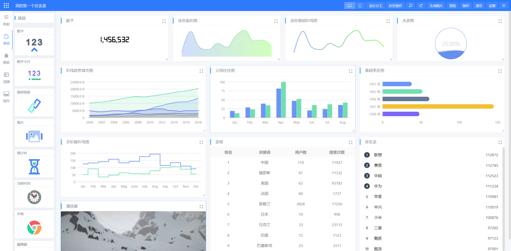

## 📚简介

🔥基于SpringBoot、MyBatisPlus、ElementUI、G2Plot、Echarts等技术栈的仪表盘设计器，具备仪表盘目录管理、仪表盘设计、仪表盘预览能力，支持MySQL、Oracle、PostgreSQL、JSON等数据集接入，对于复杂数据处理还可以使用Groovy脚本数据集，使用简单，完全免费，代码开源。

    
    
    
    
    
    
    

-------------------------------------------------------------------------------

## 效果图

## 快速开始

[快速开始](https://www.yuque.com/chuinixiongkou/bigscreen/xd78cw7t12q7kfbl#norVs)

## 演示DEMO

<a href="http://gcpaas.gccloud.com/dashboard" target="_blank"> http://gcpaas.gccloud.com/dashboard </a>
（请不要在演示环境中放入生产数据）

## 常见问题

* [使用手册、二次开发、部署手册、常见问题](https://www.yuque.com/chuinixiongkou/dashboard/index)
* [代码仓库(GitHub)](https://github.com/gcpaas/DashBoard)、[代码仓库(码云)](https://gitee.com/gcpaas/DashBoard)

## 联系我们

    

## License

Apache License 2.0
